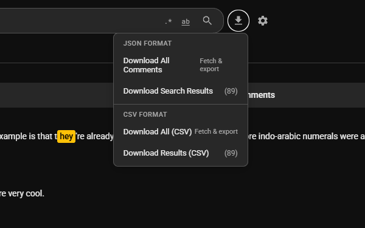

<div align="center">
  
</div>


[](https://chromewebstore.google.com/detail/oeapkmnljmmoldmaigbpccoibbkenapg)

Browser extension for searching through paginated YouTube comments. Fetches and filters all comments on a video, not just the initially loaded subset.

## Download

**Install from Chrome Web Store**: [Quack on Chrome Web Store](https://chromewebstore.google.com/detail/oeapkmnljmmoldmaigbpccoibbkenapg)

**Download Latest Release**: [GitHub Releases](https://github.com/octopols/quack/releases/latest)

## Features

### Search Capabilities

- **Comprehensive search** across all paginated comments and replies
- **Progressive result streaming** - results appear as they're found
- **Case-sensitive search** - optional exact case matching
- **Reply search** - search through all nested replies
- **Author search** - find comments by username
- **Match highlighting** - see exactly where your query matches

### Sorting Options

| Sort Order | Description |
|------------|-------------|
| Most Relevant | Ranked by search match quality |
| Top Comments | Sorted by like count |
| Newest First | Most recent comments |
| Oldest First | Chronological order |
| Most Replies | Engaging discussions first |
| Longest | Detailed comments first |
| Author (A-Z) | Alphabetical by username |

### Dynamic Sorting

Sort controls are available **during search** - watch results re-order in real-time as new comments are discovered!

### User Experience

- Native YouTube UI integration (light/dark themes)
- Real-time progress metrics during search
- Persistent settings via Chrome Storage API
- Zero impact on video playback performance

## Showcase

### Screenshots

#### Search Results


*Real-time search results streaming as comments are fetched and filtered*

#### Settings Panel


*Configurable search options including case sensitivity, reply inclusion, and match highlighting*

#### Download Comments


*Export filtered or all comments to file*

## Installation

### From Chrome Web Store (Recommended)

1. Visit [Quack on Chrome Web Store](https://chromewebstore.google.com/detail/oeapkmnljmmoldmaigbpccoibbkenapg)
2. Click "Add to Chrome"
3. Confirm the installation

### Development Build

1. Clone repository:
   ```bash
   git clone https://github.com/octopols/quack.git
   cd quack
   ```

2. Load unpacked extension:
   - Navigate to `chrome://extensions/`
   - Enable Developer mode
   - Click "Load unpacked"
   - Select the `quack` directory

3. Verify installation by navigating to any YouTube video and checking for the search input in the comments section.

## Usage

### Basic Operation

1. Navigate to a YouTube video with comments enabled
2. Locate the search input adjacent to the "Sort by" dropdown
3. Enter your query and press Enter or click the search icon
4. Results stream progressively as comments are fetched and filtered
5. Use the custom Sort dropdown to reorder results
6. Press Escape or clear input to reset

### Search Settings

Click the gear icon to configure:

| Setting | Description | Default |
|---------|-------------|---------|
| Case Sensitive | Match exact casing | Off |
| Search in Replies | Include reply threads | On |
| Search in Author Names | Match against usernames | Off |
| Highlight Matches | Highlight matching text | On |

Settings persist across sessions.

## Technical Overview

### Architecture

- Manifest V3 compliance
- Zero external dependencies (vanilla JavaScript)
- Chrome Storage API for settings persistence
- YouTube internal API for comment pagination

### Module Structure

```
quack/
├── manifest.json           # Extension manifest (V3)
├── popup.html              # Extension popup
├── icons/                  # Extension icons
├── compiled/               # Build artifacts (git-ignored)
└── src/
    ├── content.js          # Orchestration layer
    ├── ui.js               # DOM manipulation and UI rendering
    ├── fetcher.js          # YouTube API interaction and pagination
    ├── parser.js           # Comment data extraction and normalization
    ├── search.js           # Query filtering and matching logic
    ├── sorter.js           # Comment sorting algorithms
    ├── settings.js         # Chrome Storage abstraction
    └── styles.css          # Scoped styling (quack-* namespace)
```

## Permissions

**Required permissions:**
- `storage`: Chrome Storage API access for settings persistence
- `host_permissions` (`*://*.youtube.com/*`): Content script injection on YouTube domains

**Data handling:**
- All processing occurs client-side
- No external servers contacted
- No telemetry or analytics
- Settings stored locally via Chrome Storage API
- Accesses only public YouTube comment data

## Contributing

See [CONTRIBUTING.md](docs/CONTRIBUTING.md) for development setup and contribution guidelines.

## Changelog

See [CHANGELOG.md](docs/CHANGELOG.md) for release history and detailed changes.

## Release Notes

See [RELEASE.md](docs/RELEASE.md) for comprehensive release information.

## License

MIT License - see LICENSE file for details.

## Acknowledgments

Based on comment fetching logic from [youtube-comment-downloader](https://github.com/egbert/youtube-comment-downloader).
