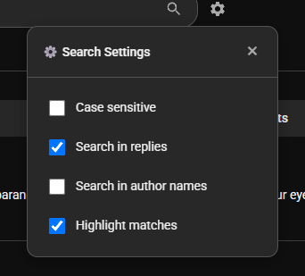

<div align="center">
  
</div>


Browser extension for searching through paginated YouTube comments. Fetches and filters all comments on a video, not just the initially loaded subset.

## Download

**Download Quack**: [Latest Release](https://github.com/octopols/quack/releases/latest)

## Features

- Comprehensive search across all paginated comments
- Progressive result streaming (no blocking UI)
- Configurable search parameters (case sensitivity, reply inclusion, author matching)
- Match highlighting with configurable toggle
- Native YouTube UI integration
- Settings persistence via Chrome Storage API
- Real-time search progress metrics

## Showcase

### Screenshots

#### Search Interface


*The search box integrated seamlessly into YouTube's comments section with search and settings icons*

#### Search in Action


*Real-time search results streaming as comments are fetched and filtered*

#### Settings Panel


*Configurable search options including case sensitivity, reply inclusion, and match highlighting*

### Features in Action

Quack integrates seamlessly into YouTube's interface, adding powerful comment search capabilities without disrupting your viewing experience. Search through thousands of comments instantly, with results streaming as they're found.

**Key highlights:**
- YouTube-native design that matches light/dark themes
- Search icon for intuitive interaction
- Progressive loading with real-time progress
- Advanced filtering options via settings panel
- Zero impact on video playback performance

## Installation

### Development Build

1. Clone repository:
   ```bash
   git clone https://github.com/yourusername/quack.git
   cd quack
   ```

2. Generate PNG icons (optional):
   Refer to `icons/README.md` for SVG to PNG conversion instructions.

3. Load unpacked extension:
   - Navigate to `chrome://extensions/`
   - Enable Developer mode
   - Click "Load unpacked"
   - Select the `quack` directory

4. Verify installation by navigating to any YouTube video and checking for the search input in the comments section.

## Usage

### Basic Operation

1. Navigate to YouTube video with comments enabled
2. Locate search input adjacent to "Sort by" dropdown
3. Enter query string and press Enter or click the search icon
4. Results stream progressively as comments are fetched and filtered
5. Press Escape or clear input to reset

### Configuration

Click the settings icon (gear icon to the right of the search box) to configure:
- `caseSensitive`: Match exact casing (default: false)
- `searchInReplies`: Include reply threads (default: true)
- `searchInAuthorNames`: Match against author field (default: false)
- `highlightMatches`: Apply highlighting to matched strings (default: true)

Settings persist across sessions via Chrome Storage API.

## Technical Overview

### Architecture

- Manifest V3 compliance
- Zero external dependencies (vanilla JavaScript)
- Chrome Storage API for settings persistence
- YouTube internal API for comment pagination

### Module Structure

```
quack/
├── manifest.json           # Extension manifest (V3)
├── popup.html             # Extension popup
├── icons/                 # Extension icons (16x16, 48x48, 128x128)
└── src/
    ├── content.js         # Orchestration layer
    ├── ui.js             # DOM manipulation and UI rendering
    ├── fetcher.js        # YouTube API interaction and pagination
    ├── parser.js         # Comment data extraction and normalization
    ├── search.js         # Query filtering and matching logic
    ├── settings.js       # Chrome Storage abstraction
    └── styles.css        # Scoped styling (quack-* namespace)
```

## Permissions

Required permissions:
- `storage`: Chrome Storage API access for settings persistence
- `host_permissions` (`*://*.youtube.com/*`): Content script injection on YouTube domains

Data handling:
- All processing occurs client-side
- No external servers contacted
- No telemetry or analytics
- Settings stored locally via Chrome Storage API
- Accesses only public YouTube comment data via standard DOM/API

## Contributing

See [CONTRIBUTING.md](docs/CONTRIBUTING.md) for development setup and contribution guidelines.

## Changelog

See [CHANGELOG.md](docs/CHANGELOG.md) for release history and detailed changes.

## Release Notes

See [RELEASE.md](docs/RELEASE.md) for comprehensive release information and installation guide.

## License

MIT License - see LICENSE file for details.

## Acknowledgments

Based on comment fetching logic from [youtube-comment-downloader](https://github.com/egbert/youtube-comment-downloader).
